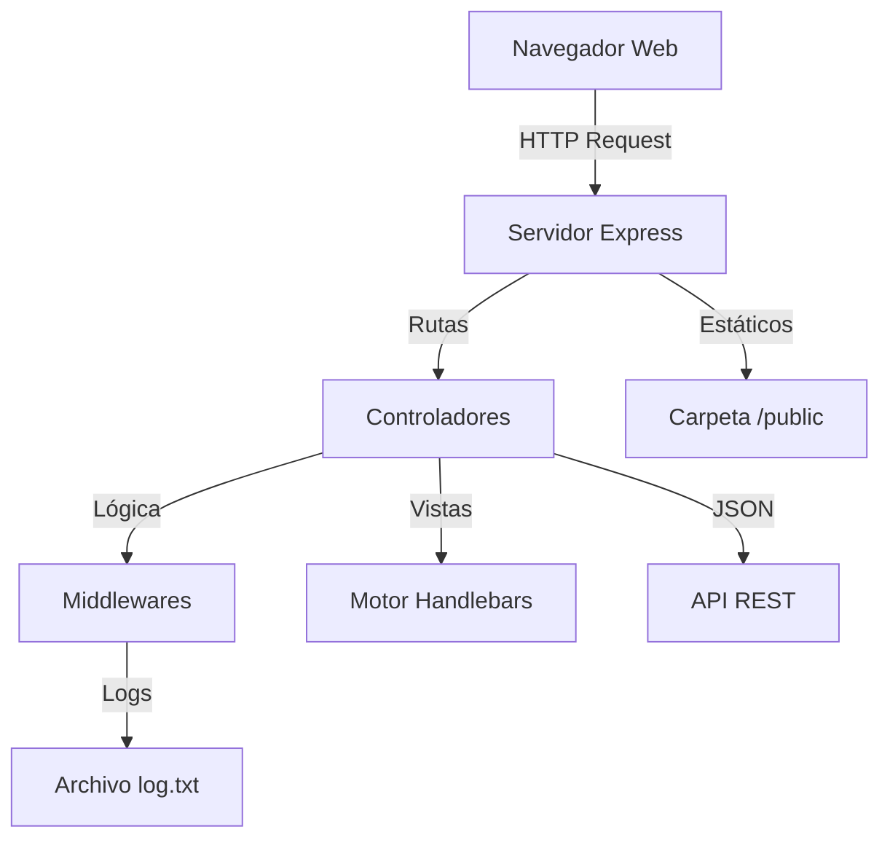

# Proyecto Node y Express - ABP 6

Este repositorio contiene la primera parte del desarrollo de una aplicación web estructurada,
construida con Node.js y el framework Express. El objetivo de e sta fase es establecer los cimientos
del servidor gestionar rutas modulares y servir contenido tanto estatico como dinamico 


## Requisitos del sistema 
 Node.js V18+ | Express.js | Handlebars | Es modules

 ## Instrucciones de instalación y ejecución

 1. **Clonar el repositorio:**
   ```bash
   git clone [https://github.com/kevynceledon-ui/node-express-abp6.git]
   (https://github.com/kevynceledon-ui/node-express-abp6.git)
   cd node-express-abp6
   ```

 2. Ejecutar el siguiente comando en la terminal para instalar las dependencias necesarias
      **("Express", "dotenv", "hbs")**.
      **Comando:** npm install

 3. Crear un archivo .env en la raiz del proyecto basándose en el archivo **env.example**
        Definir el puerto de ejecución (Por defecto : 3000)

 4. Para ejecutar el entorno de desarrollo usar:
    **npm run dev** inicia el servidor con **Nodemon**, reiniciandolo automaticamente si hay cambios.

5- para ejecutar en modo de producción usar:
    **npm start** inicia de forma estandar con Node.

## Flujo de Datos Detallado
Cliente solicita una URL (ej: http://localhost:3000/)

Express recibe la petición y aplica middlewares en orden:

express.json() → Parsea cuerpos JSON

express.static() → Sirve archivos de /public si coinciden

logMiddleware → Registra visita en logs/log.txt

Router (mainRoutes.js) enruta a la función del controlador

Controller (mainController.js) procesa la lógica:

Para /: Renderiza home.hbs con datos dinámicos

Para /status: Devuelve objeto JSON

Respuesta se envía al cliente (HTML o JSON)

## Estructura del proyecto

Se ha implementado una arquitectura modular basada en el patrón "MVC" para asegurar la
estabilidad futura:

- **📂 /controllers:** Contiene la lógica que maneja las peticiones y respuestas.
- **📂 /logs:** Directorio de persistencia de datos en archivos planos (log.txt).
- **📂 /middlewares:** Funciones que interceptan las peticiones (como el registro de acceso).
- **📂 /public:** Directorio para servir recursos y archivos estáticos.
- **📂 /routes:** Definición de los endpoints y enrutadores.
- **📂 /utils:** Herramientas auxiliares y configuraciones globales.
- **📂 /views:** Plantillas dinámicas renderizadas en el servidor (HBS).

## Diagrama de arquitectura con Mermaid

Opte por la opción de utilizar **Mermaid** por la simplicidad para generar diagramas, ya que se basa en una 
herramienta de javascript para generar diagramas dinámicamente.
tiene una integración nativa con Github ya que soporta mermeid por defecto en cualquier archivo **.md**




## Justificaciones técnicas

Para cumplir con los estándares de desarrollo de backend, se tomaron las siguientes definiciones de arquitectura:

**Archivo principal:** Se eligio el nombre de **app.js** en lugar del clásico index.js porque semánticamente representa
la configuración y el levantamiento de la aplicación completa de Express, separando este archivo conceptualmente de 
un simple indice de exportaciones.

**Scripts de ejecución:**Se configuró **npm start** para levantar la aplicacion con Node nativo que es lo idea para producción.
Por otro lado, **npm run dev** utiliza dependencia de desarrollo **nodemon** para reiniciar el servidore automáticamente ante 
cualquier cambio en el código agilizando el fujo de trabajo.

**Estructuras de carpetas extendida:**Además de las carpetas minimas requeridas por la consiga, decidi incorporar
**/utils** y **views**.Esta separación de responsabilidades prepara el terreno para futuras integraciones.

**Persistencia de datos en archivos plano (fs):** Se implementó el módulo nativo fs dentro de un middleware personalizado.
Cada vez que un usuario hace una petición, el sistema anexa mediante el **apendfile** un registro en **logs.txt** sin
detener el flujo de la aplicación. Esto cumple con el requisito de almacenamiento simple.

**Variables de entorno (dotenv) y seguridad (.gitignore):** El uso de **dotenv** permite que el puerto y el entrono no estén
codificados("Hardcodeados")en el código fuente. Al combinar esto con **.gitignore** aseguramos que las configuraciones locales
de cada desarrollador no se filtren al repositorio publico de Github, aplicando una capa básica de seguridad.

**Modulo ES6 y pathHelper.js:**El proyecto esta configurado bajo el estandar moderno de JS dado que esto deshabilita las 
variables globales utilizadas por "CommonJs", se creo un helper especifico en este caso **pathHelper.js** en la carpeta
**/utils** para recrear **__dirname** y resolver rutas absolutas de forma segura en todo el ecosistema.

**Motor de plantillas(HBS):** en lugar de limitar a servir un HTML estatico , implemente **Handlebars**. Esto cumple
con el requirimiento de servir vistas dinámicas, permitiendo inyectar datos como fechas, horas y nombres de usuario
directamente desde el controlador antes de enviar la respuesta al cliente.

## Ejemplos de uso (Endpoints)

Una vez iniciado, se puede probar el funcionamiento accediendo a:

**GET/** ruta raiz: renderiza la vista dinámica de **home.hbs**. Al acceder el **logmiddleware** registra la visita 
silenciosamente en el archivo **log.txt**.

**GET /status** ruta de estado: Devuelve un objeto JSON con el mensaje {"status": "OK", "message": "El servidor está funcionando correctamente"}.


links directo a repositorio en github:
https://github.com/kevynceledon-ui/node-express-abp6.git


link directo a drive:
https://drive.google.com/drive/folders/1gtQoJZwlpUOnVKH77Ll-_If8TS7gXkzK?usp=sharing

